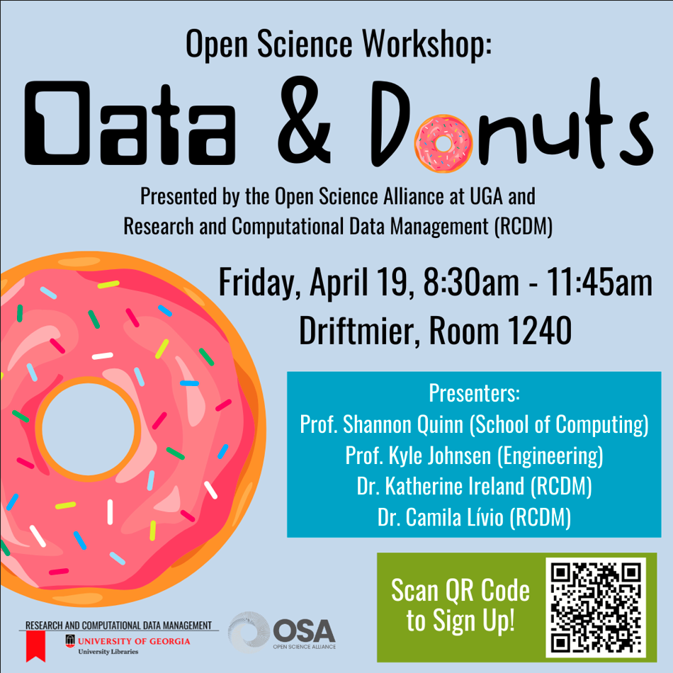

# Data & Donuts

Data &amp; Donuts workshop on Reproducible Research

Welcome! These slides were built using [Quarto](https://quarto.org/). The easiest way to view them may be to check out the entire repository, then open up the `*.html*` files to go through the slides.

**NOTE**: Make sure you preserve the structure and files of the entire repository! The HTML slides will reference images in the `assets` folder and Javascript files in the `*_files` folders, so you'll need everything here, not just the HTML files.

**Browser Note**: In developing these slides, I found Firefox to be problematic at best with viewing the slides. Chrome, however, seems to work perfectly.

Slides as presented, in order:

 - [Part 1: Introduction](https://openscialliance.github.io/data-donuts-apr2024/introduction.html) (presented by Shannon Quinn and Kyle Johnsen)
 - [Part 2: Getting Started with Reproducible Research](https://openscialliance.github.io/data-donuts-apr2024/reproducible-research.html) (presented by Shannon Quinn)
 - [Part 3: Build your own Project](https://openscialliance.github.io/data-donuts-apr2024/byop.html) (presented by Kyle Johnsen)
 - Part 4: Data Management and Reproducibility (presented by Katherine Ireland and Camila Lívio)
